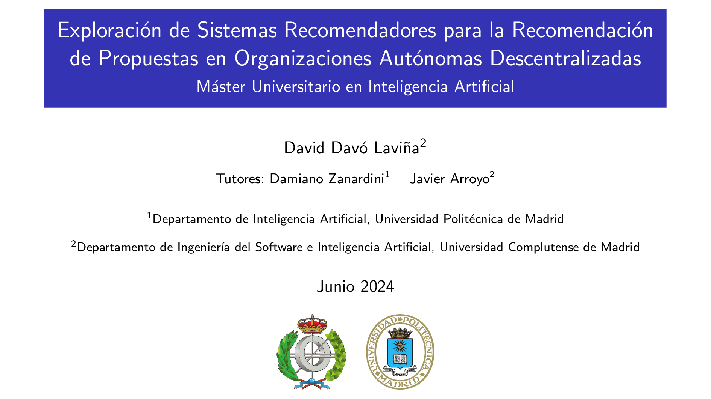

# Presentación TFM

## Exploración de Sistemas Recomendadores para la Recomendación de Propuestas en organizaciones Autónomas Descentralizadas

Esto es solo un pequeño índice para que la presentación se compile y se
distribuya gratis con GitHub pages.

-   [Versión proyector](https://daviddavo.github.io/upm-tfm-presentacion/David_Davo_TFM_beamer.pdf)
-   [Versión impresa (sin animaciones)](https://daviddavo.github.io/upm-tfm-presentacion/David_Davo_TFM_handouts.pdf)
-   [Código fuente (LaTeX)](https://github.com/daviddavo/tfm-presentacion)
-   [Proyecto completo (GitHub)](https://github.com/daviddavo/upm-tfm-notebooks)

Otros enlaces:
-   [ORCID](https://orcid.org/0000-0003-1744-8314)
-   [LinkedIn](https://www.linkedin.com/in/ddavo/)
-   [Web Personal](https://ddavo.me/es)